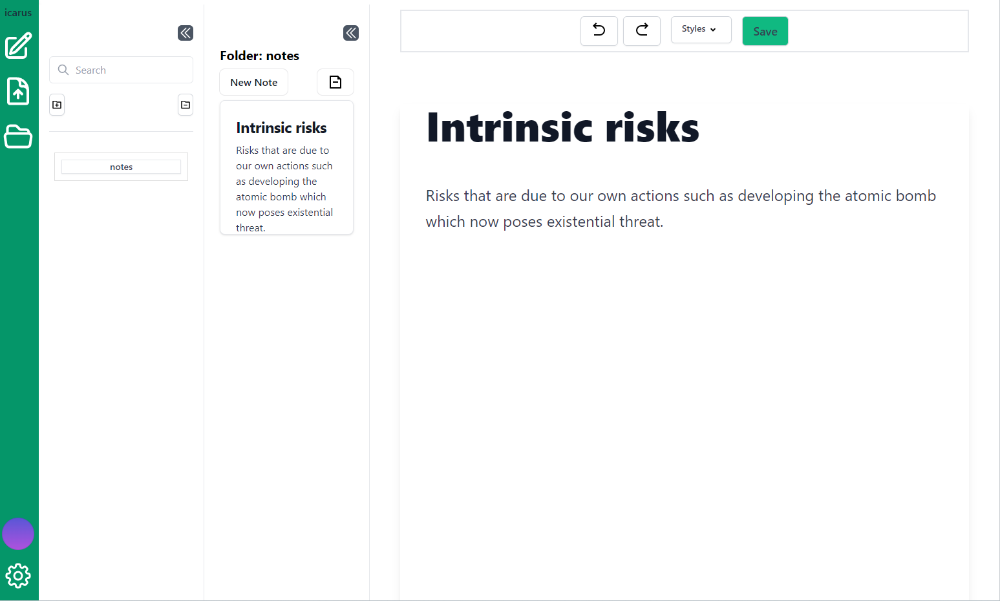

# icarus

A place to collect notes.
Live demo at [icarus.community](www.icarus.community)

## A learning community

[Discord](https://discord.gg/EJRjGehA)

## How to use

1. Take note
2. Click the green save button
3. Commit your notes.

Disclaimer: Don't commit notes that you don't want to be public because committing notes makes them public so that anyone can see.

## Tech stack

- Nextjs
- Tableland
- TipTap
- Connectkit
- Zustand
- Tailwind css
- IPFS
